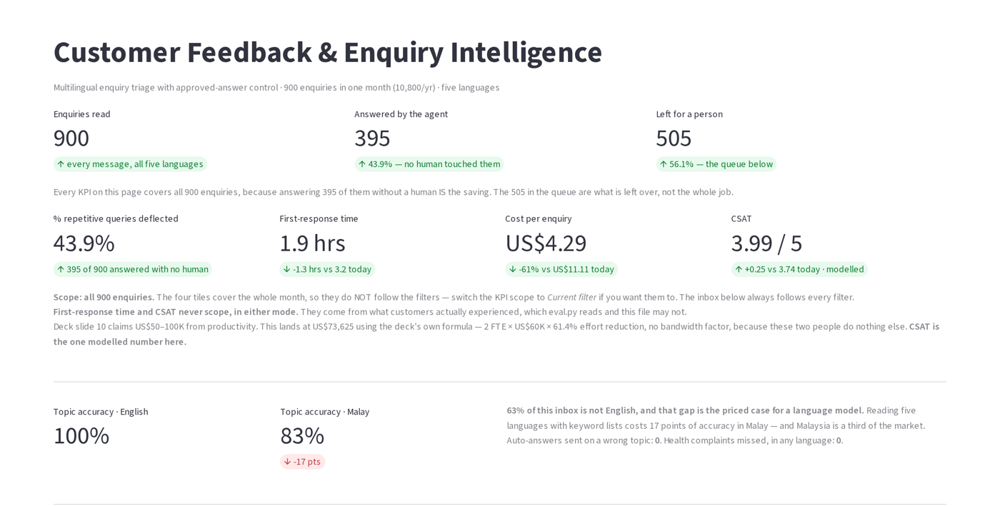

# Customer Feedback & Enquiry Intelligence Agent

Scores 900 customer enquiries across five languages (English, Singlish, Malay,
Bahasa Indonesia, Mandarin) and decides which can be answered from a
pre-approved library without a human.

*Vela is a fictional consumer brand. Every message, answer and outcome in
this repository is synthetic.*

**No LLM.** Keyword lists per language plus a regex for order references. The
Gemini version hit a 20-request-per-day free-tier wall, so this reads the same
900 messages for free, instantly, identically on every run - and eval.py prices
exactly what that costs in accuracy.

**[▶ Open the live app](https://customer-enquiry-agent.streamlit.app/)**

*Hosted free; if it shows a "wake app" button, give it about 30 seconds.
All data is synthetic — no customer messages appear anywhere in this repository.*

## Run it

    pip install -r requirements.txt
    python -m streamlit run app.py

data/ and store/ are committed, so the app runs straight from a clone. The app
computes nothing at demo time - it reads pre-written CSVs.

## Rebuild the outputs from scratch

    python extract.py    # reads the 900 messages -> store/extractions.json
    python store.py      # runs main + rules, 3 hard rules -> decisions, drafts, reviews
    python eval.py       # opens the answer key   -> store/scorecard.csv
    python -m streamlit run app.py

## The files

| file | what it does |
|---|---|
| extract.py | the only file that reads a customer's words. Keyword lists, five languages. Reports, never decides. |
| rules.py | six gates in severity order. Safety first and unconditional. |
| main.py | the driver. Loops all 900, computes the two KPIs it is allowed to. |
| store.py | the audit trail. Three hard rules; exits non-zero if any breaks. |
| eval.py | the ONLY file allowed to open ground_truth.csv and outcomes.csv. Publishes scorecard.csv. |
| app.py | the inbox. Reads CSVs only; imports neither rules nor main. |

## The tests

    python -m pytest -q          # 12 tests, ~2s

Properties, not numbers. Pinning "395 deflected" would break whenever a
keyword list changed and would prove nothing about whether the agent is safe.

The one that matters is **`test_health_complaints_survive_the_safety_gate_being_deleted`**.
The claim above — that the guardrail is a missing row rather than a rule — is
easy to state and easy to be wrong about, so the test switches gate 1 off
entirely and re-scores every health enquiry. None may be auto-answered,
because gate 4 still has nothing approved to send.

Verified by breaking it: adding a `Health complaint` row to
`approved_answers.csv` makes that test fail, exactly as it should. The
guardrail would have quietly become one rule deep instead of two.

| Test | What breaks it |
|---|---|
| Health complaints survive gate 1 being deleted | An approved answer is added for a health topic |
| Nothing unclassified is answered | Gate 2 starts guessing a topic instead of asking |
| Every auto-answer names an approved answer | A draft is generated rather than selected |
| Nothing needing an order reference is sent without one | Gate 5 is reordered after the send |
| The third contact this month goes to a human | The repeat-contact gate is bypassed for answerable topics |
| Scoring twice gives the same answer | A tie-break starts depending on dict ordering |

## Headline results

- 43.9% deflected - 395 of 900 answered with no human
- US$11.11 -> US$4.29 per enquiry; US$73,625/yr (deck band 50-100K)
- First response 3.2 -> 1.9 hrs; CSAT 3.74 -> 3.99 (MODELLED, labelled as such)
- Health-complaint recall 100%, 0 auto-answered - and still 0 with the safety
  gate deleted, because "Health complaint" has no row in approved_answers.csv
  in any language. The guardrail is a missing row, not a rule.
- Topic accuracy 94.8% overall - English 100%, Malay 83%. That 17-point gap is
  the priced case for a language model.
